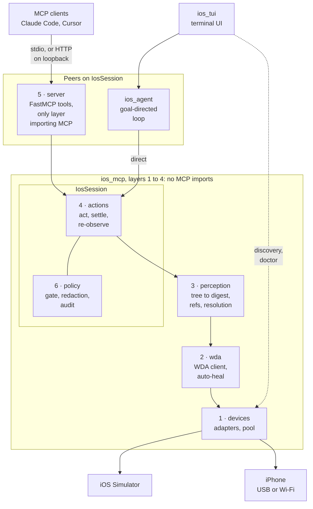

# Architecture

Six layers. Layers 1 to 4 are a plain async library with no MCP imports, so an
agent framework can import `IosSession` directly and skip the protocol
round-trip on latency-critical steps. The MCP server is one consumer of that
library, not the thing itself, and `ios_agent` is a second one: a peer of the
server rather than a layer above it, since the policy gate lives inside
`IosSession` and both pass through it identically. `ios_tui` is a third
distribution on top of the agent, and it is separate for a concrete reason
rather than a tidy one: the agent is held to a seven-module public surface, and
a front end needs device discovery and the doctor, which are outside it. See
`docs/adr/0008-the-front-end-is-a-third-distribution.md`.
`tests/unit/test_layering.py` enforces the no-MCP-imports rule, the agent's
public surface, and the front end's Textual-free event path statically.

The numbers are the section numbers below. Layer 6 is drawn inside
`IosSession` because that is where it is constructed: every action passes
through it, whichever consumer started the call.

## 1. Device fabric (`ios_mcp/devices/`)

One `DeviceAdapter` protocol, two implementations, so nothing above branches on
device kind.

`SimulatorAdapter` uses `simctl` for what WebDriverAgent cannot do: privacy
permissions, location, appearance, freezing the status bar for reproducible
screenshots. `RealDeviceAdapter` uses `go-ios`, including the RemoteXPC tunnel
that iOS 17+ requires.

Starting WebDriverAgent differs fundamentally between the two, and this is not
a detail that can be abstracted away:

- **Simulator**: must go through `xcodebuild test-without-building` against a
  prebuilt `.xctestrun`. `simctl launch` on the `.xctrunner` app cannot work,
  because the app aborts immediately without an XCTestConfiguration that only
  `testmanagerd` supplies.
- **Device**: `go-ios` drives `testmanagerd` directly, so a signed prebuilt
  runner app can be launched without Xcode.

`DevicePool` keeps one live session per device, allocates ports, and reclaims
idle leases. It is where a remote or device-farm adapter would drop in.

## 2. WebDriverAgent client (`ios_mcp/wda/`)

A typed `httpx` client. No Appium.

Two things happen here that everything above depends on. **Session settings**
are pushed on every new session: WebDriverAgent's default snapshot depth
produces trees far too large and slow for an agent loop. **Auto-heal** catches
a dead session or a crashed runner, rebuilds it, restores the foreground app,
and retries once, reporting `recovered` rather than raising. An agent driving a
phone for minutes will outlive at least one runner crash, and making it reason
about that wastes its turns.

## 3. Perception (`ios_mcp/perception/`)

Where the cost of the whole system is decided. Raw page source for a 200-row
list is roughly 37,000 tokens; the digest is 329.

The pipeline is prune, deduplicate, collapse repeats, score, budget, assign
refs. Two rules do most of the work:

- **Wrapper collapse.** Containers that exist only to hold other nodes are
  dropped, as are StaticText children echoing their row's own label. iOS emits
  that echo for nearly every list row.
- **Coincidence merge.** iOS reports one control several times: a row-wide
  element carrying the label, and the control itself at the trailing edge.
  These merge into one node that takes *semantics from the labelled node and
  geometry from the tighter one*. That split is not cosmetic. Keeping the row's
  rect aims taps at the label, where a switch ignores them, so `set_value`
  reports success while changing nothing.

Overlap is proportional rather than strict containment, because real iOS rects
do not nest: a Settings toggle reports `x=305 w=63` inside a row at `x=36
w=330`, overhanging its own parent by two points.

**Resolution** runs a six-tier chain server-side, so a retry costs zero model
tokens where bouncing back to the model costs a whole turn:

| Tier | How |
|---|---|
| `exact` | ref from the last digest, verified to still denote the same element |
| `id` | stale ref, re-found by accessibility identifier |
| `label+role` | stale ref, re-found by label and role |
| `proximity` | stale ref, nearest same-role element |
| `text-exact` / `id-exact` | plain-language target, exact match |
| `text-partial` / `text-fuzzy` | substring, then edit distance |

Refs are positional, so inserting a row shifts every ref below it. Tier 1
therefore verifies identity before trusting position; acting on the wrong
control is the worst failure this system can have. `RefTable` records only what
the agent was actually shown, which is what makes that check possible.

Ambiguity is refused, not guessed: two identically labelled Delete buttons
raise with both candidates listed.

**Fingerprints** hash structure, state and title. Positions round to 4px so
animation jitter does not register while real shifts do. The title is included
because a split view keeps most of the screen identical during navigation.

**Find** reads the raw tree the digest compacted, and says of each match whether
the digest kept it (`shown`) or dropped it (`hidden`, named by its id). It
returns no refs, so it is never mistaken for an observation. See
`docs/adr/0011-a-find-that-reads-the-tree-the-digest-threw-away.md`.

**Screens with no tree** are reported rather than returned looking empty. A
Flutter canvas or a web view has no accessibility children at any price, so the
digest carries a note saying so. See
`docs/adr/0007-report-unreachable-content-rather-than-reaching-it.md`.

**Redaction applies to what a digest says, never to what it holds.** `IosSession`
attaches its redactor to every digest, change, action result and find it hands
out, so card numbers and emails are stripped whoever renders them. The nodes
stay raw, because refs, fingerprints and resolution all run on them, and
resolution comparing a redacted label against a raw tree would read every
redacted element as a different one.

## 4. Actions (`ios_mcp/actions/`, `ios_mcp/session.py`)

Every action is act, stabilize, re-observe in one call. An observe/act/observe
loop costs two round-trips per step; folding the observation in halves that.

- **Fresh geometry.** Every action re-reads the screen before acting rather
  than trusting the last observation. Seconds of model latency sit between
  observe and act, and anything that moved in between would send the tap to
  whatever now occupies those coordinates.
- **Stabilization** polls the fingerprint until it repeats, rather than
  sleeping a fixed interval. An optional baseline keeps it polling while the
  screen still matches its pre-action state, so a slow transition is not
  mistaken for an action that did nothing.
- **Deltas.** When the screen is structurally similar the result is a diff
  (`~ e2 switch "Bold Text" =1 (was 0)`); a genuine navigation returns the
  whole screen.
- **Already satisfied** is reported when `set_value` finds a switch already in
  the requested state and declines to tap. A switch left alone for that reason
  and a switch that refused to move return otherwise identical payloads, and
  this is the one moment the difference is known.
- **Idempotency keys** make a repeat a no-op returning the original result.
  This exists from the first action because agent frameworks re-run the node an
  interrupt was raised from, and retrofitting act-once semantics after callers
  exist is not safely possible.

## 5. MCP surface (`ios_mcp/server/`)

Roughly 30 semantic tools, not a mirror of WebDriverAgent's HTTP routes: a
large set of confusable tools measurably degrades tool selection. A test
asserts the count stays bounded.

Digest payloads omit the structured element list by default. It duplicates the
rendered text at roughly twice the tokens, and both would be pushed into the
model's context, so sending both means paying twice for one screen.

Errors reach the client as structured JSON carrying a code, a hint, and
candidate elements, so a failed resolution tells the agent what it could have
picked instead.

stdio is the default transport and every shipped configuration uses it. The
HTTP transport has no authentication, because its use is a client on the same
machine, so it checks `Host` and `Origin` against DNS rebinding and refuses to
bind anything but loopback without `--allow-remote`.

## 6. Policy (`ios_mcp/policy/`)

Constructed inside `IosSession`, so the server, the agent and the terminal front
end all pass through it on the same code path.

The approval gate asks two questions before an action runs, each switched
separately: does it destroy data or cost money, and does it reach another
person (`docs/adr/0014-ask-before-reaching-another-person.md`). Both are
whole-word matches over labels, so both are a heuristic; the app allowlist and
a person watching are the controls.

See [SAFETY.md](SAFETY.md) for each control and its limits, and
[the threat model](docs/threat-model.md) for what they defend against and what
is accepted rather than defended.

## The agent (`agent/ios_agent/`)

A separate distribution in the uv workspace, depending on `ios-mcp` and never
the reverse. It is a second consumer of `IosSession`, not a seventh layer: the
policy gate is constructed inside the session, so an agent passes through it on
the same code path the server does.

The loop is one model node, one tool node, and an edge back. Ten tools rather
than the server's thirty-one, because a large confusable set degrades tool
selection: nine verbs and `done`. The tenth verb, `find`, was measured at about
190 prompt tokens on every turn of every run, which is the argument against an
eleventh. The provider is chosen through `init_chat_model`, so the package
commits to no vendor. An optional cascade (`IOS_AGENT_ROUTE_MODEL`, off by
default) starts a run on a smaller model and moves to the configured one at the
first sign of trouble; see `docs/adr/0015-route-routine-turns-to-a-small-model.md`.

An action the gate asks about, one that is destructive or reaches another
person, **pauses the graph** with a LangGraph `interrupt()` rather than being
decided on the phone owner's behalf. The gate classifies before
acting, so nothing has touched the device at the moment of the pause, and with
no approver attached everything destructive is refused: an unanswerable
question is not consent.

Resuming re-runs the entire node, which is why every action's idempotency key
is its **tool call id** rather than a step counter. A counter yields a
different key on the re-run, misses the cache, and taps the device twice; a
test asserts this by putting a harmless tap in the same turn as one that needs
approval and counting what reaches the device.

What is *not* in it is the interesting part. Planning, subagents,
cross-session memory, multi-action batching and per-app skill files were each
specified, measured, and rejected with numbers, as was a defence against
instructions planted in screen content; see [docs/adr/](docs/adr/). The one
mechanism of the original design that survived is verification,
and it exists because actions already return the screen they produced: it reads
`screen_changed` and the delta to notice an action the device ignored, and
costs zero additional observations. That cut actions across the task set by 38%.

The agent's own report is kept apart from the device's. `Outcome.succeeded` is
what the model claimed; `Outcome.verified` is that claim after the device has
been allowed to contradict it. A claim of success is contradicted when the run
acted and no action either moved the screen or found its element already as
asked. The CLI's exit code follows the verdict, not the claim.

The reason verification can cost nothing is layer 4's design. Because an action folds its
resulting screen into the response, the agent spends exactly one observation
per task, which is the same number a hand-written oracle needs. The
observation-per-step cost that this whole stack was optimised against turned
out to be already at its floor before any agent pillar was built.

## Testing

- `tests/unit` (731) runs against an in-process fake WebDriverAgent, so it
  needs no Xcode, simulator, or phone. It also enforces the layering statically:
  only `ios_mcp/server` may import MCP, and `ios_agent` may touch only a listed
  public surface.
- `tests/tui` (212) covers the terminal front end, including that watching a
  run does not change what it costs, asserted by equality.
- `tests/integration` (21: 18 against a simulator, 3 against a physical device)
  runs against real iOS, including a chaos test that kills the runner mid-flow.
  The device tests are opt-in twice: a marker, and `IOS_MCP_ALLOW_DEVICE=1`.
- `tests/evals` (11 flows) measures tokens, wall time, action count, and
  resolution-tier distribution. These four numbers are the product metrics.
- `tests/evals/agent` measures the agent itself: 19 goal-directed tasks against
  a scripted device, each declaring the action count a hand-written oracle
  needs, asserted by equality. They include failures injected from real
  hardware, four tasks that plant an instruction in screen content, and tasks
  in an app Apple did not write. A `model` tier puts a real model in the loop,
  and a `simulator` tier runs it against real iOS.
- The free series is committed to `tests/evals/history.jsonl` and CI fails when
  a number moves without a new line recorded beside it. See
  `docs/adr/0009-the-eval-trend-is-committed.md`.

The fakes cannot catch everything. Every bug in the Phase 5 commit was found
only by running against a real device, which is why the eval suite exists.
