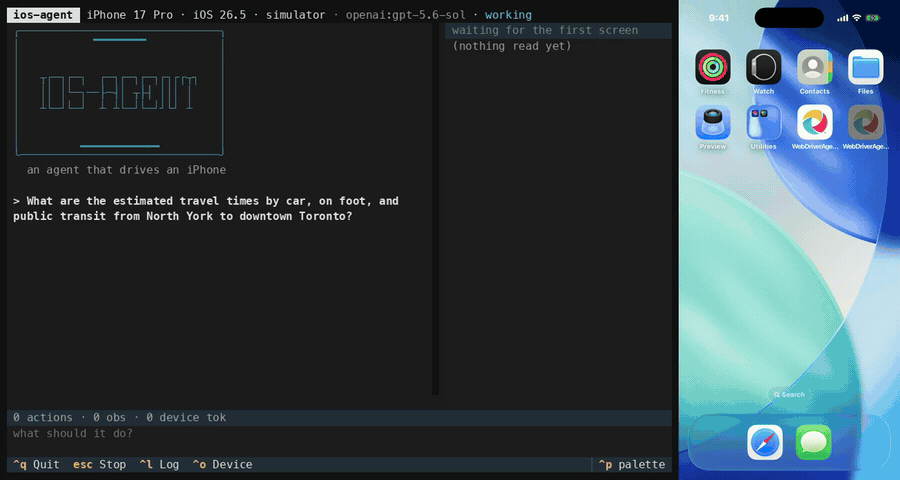

# ios-agent

**Drive an iPhone or an iOS Simulator with an AI agent.** A terminal app, an
MCP server, and the library beneath both.

[](https://github.com/emazaheri/ios-agent/actions/workflows/ci.yml)
[](LICENSE)
[](https://www.python.org/downloads/)
[](#requirements)
[](#development)



<sub>One goal, start to finish, at 2.5x. The agent deep-links into Maps for the
driving time, then taps through to walking and transit and scrolls to read the
detail: 4 actions, 1 observation, 2,767 device tokens, 49.8s of real time. The
terminal is the agent's own transcript; the phone is an iOS Simulator being
driven by it.</sub>

Built on Apple's XCUIAutomation through WebDriverAgent. It runs on a Mac and
drives a simulator or a tethered phone. It is designed for **agents rather than
test suites**: screens arrive as a compact digest instead of raw accessibility
XML, actions hand back the screen they produced, and anything irreversible asks
first.

```bash
uv sync && uv run ios-agent quickstart
```

`quickstart` checks the toolchain, offers the repairs that are cheap enough to
be worth offering, builds WebDriverAgent if it is missing (about 20 seconds,
once), and drops you into manual mode, which drives the device by hand and
needs no API key. When you want the agent itself:

```bash
uv run ios-agent "turn on bold text"
```

## Contents

- [Why it is built this way](#why-it-is-built-this-way)
- [Requirements](#requirements) · [Setup](#setup)
- [The terminal app](#the-terminal-app)
- [Connecting your own agent over MCP](#connecting-your-own-agent-over-mcp)
- [What the model sees](#what-the-model-sees)
- [Safety](#safety)
- [Measured on real hardware](#measured-on-real-hardware)
- [Development](#development) · [Contributing](#contributing)

## Why it is built this way

Raw WebDriverAgent page source for a 200-row list runs to roughly **37,000
tokens**. Re-reading that after every tap exhausts a context window in a handful
of steps. Four decisions follow from that, and they are the whole design:

| | |
|---|---|
| **Perception is budget-aware** | 251 raw nodes to 12 elements on a real third-party screen; 50–445 tokens per step |
| **Actions return the screen they produced** | halves round-trips, and returns a *delta* when the screen is similar |
| **Resolution runs on the host** | six tiers, so a retry costs zero model tokens where a round-trip costs a whole turn |
| **The gate asks before acting, not after** | so the answer still means something |

Everything else in the repository is downstream of those.

## Requirements

| For | You need |
|---|---|
| **Simulator** | macOS, Xcode 16.3+, an iOS runtime, Python 3.12+ |
| **Physical iPhone** | the above plus [go-ios](https://github.com/danielpaulus/go-ios), Developer Mode, and a signing identity. Follow [docs/real-device-setup.md](docs/real-device-setup.md), which is a longer road than the simulator and has a few steps that look like bugs but are not |

Xcode ships **without** a simulator runtime. If `xcrun simctl list runtimes` is
empty, `xcodebuild -downloadPlatform iOS` fetches one (around 8 GB). If a
runtime is installed but no simulator has been created, `ios-agent` offers to
create one for you: that part takes about a second.

## Setup

```bash
uv sync
./scripts/prepare_wda.sh simulator   # builds WebDriverAgent, once
uv run ios-agent doctor              # says exactly what is still missing
```

`doctor` is the first thing to run whenever anything misbehaves. It checks the
toolchain, the simulator runtimes, the tunnel, WebDriverAgent's signing expiry
and the model, and returns a **remedy for each failure** rather than letting it
surface later as a connection error.

The app runs those same checks before it touches a device, so a machine that is
not set up is told so in about a second rather than after a simulator has
booted.

## The terminal app

```bash
uv run ios-agent                             # open it, decide later
uv run ios-agent "turn on bold text"         # give it a goal
uv run ios-agent --pick "turn wi-fi off"     # choose the device from a list
uv run ios-agent manual                      # drive it by hand, no model needed
uv run ios-agent devices                     # what is reachable
```


It streams the model's reasoning as it arrives, shows the digest the model is
reading beside it, and keeps the numbers on screen while they climb: actions,
observations, device tokens, cost.

| | |
|---|---|
| `/` | command menu, filtered as you type |
| `/device` · `ctrl+o` | switch phone or simulator mid-session |
| `esc` | stop at the next step, with a complete report; again to abort |
| `ctrl+r` · `ctrl+s` | re-read the screen · save the audit trail |
| `/copy` · `ctrl+y` | copy the transcript, or a selection, to the clipboard |
| `--inline` | run in a short region under the prompt |
| `--no-tui` | plain lines, for a pipe |

**`manual` mode needs no API key.** It drives the same ten verbs by hand,
which is the fastest way to debug perception on an app nobody has pointed this
at before.

The front end is held to one rule, asserted rather than argued: **watching a
run may not change what it costs.** `tests/tui/test_cost.py` runs the same task
wrapped and unwrapped and compares every counter by equality.

### Choosing a model

The provider is configuration, not a dependency. The loop builds through
LangChain's `init_chat_model`, so switching is two environment variables and an
extra:

```bash
uv sync --extra openai
IOS_AGENT_PROVIDER=openai IOS_AGENT_MODEL=gpt-5.6-sol uv run ios-agent "..."
```

Anthropic, OpenAI, Gemini, Bedrock, Groq, Mistral and a local Ollama model are
all supported. See [agent/README.md](agent/README.md).

## Connecting your own agent over MCP

31 tools and 4 resources, over stdio or HTTP. Add to `.mcp.json` (already
present here for Claude Code):

```json
{
  "mcpServers": {
    "ios": { "command": "uv", "args": ["run", "--directory", ".", "ios-mcp", "serve"] }
  }
}
```

Then ask for what you want in plain language. The server ships an `ios_operator`
prompt that teaches the observe/act/verify loop, so clients do not have to
reinvent it. For a remote client, `ios-mcp serve --transport http --port 8765`.

Or skip the protocol and import the library:

```python
outcome = await run_goal(session, "turn on bold text")
```

## What the model sees

```
screen: com.apple.Preferences / "Display & Text Size"  fp=3872280e
e1   button       "Accessibility" id=BackButton @(38,84)
e2   switch       "Bold Text" =0 id=ENHANCE_TEXT_LEGIBILITY @(336,161)
e3   button       "Larger Text, Off" id=LARGER_TEXT @(190,216)
```

Measured across eleven golden flows on a real simulator: **50 to 422 tokens per
tool call.**

The agent passes `e2` back to an action. It never writes XPath and never
guesses coordinates. If a ref goes stale because the screen moved, the host
re-finds the same element by identity rather than failing.

## Safety

Automating someone's real phone is not test automation. On by default:

- Anything matching **Send, Pay, Buy, Delete, Confirm or Sign Out** needs
  approval *before* it happens, via MCP elicitation or an
  `action_requires_approval` error an external human-in-the-loop layer can
  answer. Approval is scoped to one action: approving Send never approves
  Delete.
- Without an approver the run is unattended and everything destructive is
  **refused**, because an unanswerable question is not consent.
- `ios_type_secret` reads a value from the host keychain and sends it straight
  to the device. It never enters a prompt, a tool result, or the audit trail.
- Card numbers and email addresses are stripped from everything leaving the
  server.
- Repeated failures or a detected loop halt the session.
- The device picker never pre-selects a physical phone. Reaching one always
  costs a keystroke.

See [SAFETY.md](SAFETY.md). Every default is settable through an `IOS_MCP_*`
environment variable, a `.env`, or an optional `ios-mcp.toml`, in that order of
precedence. Copy `.env.example` to `.env` for the full list.

## Measured on real hardware

The eval harness was built before the agent, which is the only reason any
of these numbers exist. Latest measurement, 13 tasks × 3 runs on
`gpt-5.6-sol`:

| | |
|---|---|
| success | 39/39 |
| observations | **41, against an oracle floor of 39** |
| actions | **123, 1.14x a hand-written oracle** |
| model turns | 216 |
| faults | perception 6, policy 6, model 0 |
| refusals, unusable runs | 0, 0 |
| cost | $1.87 over 6m39s |

One observation per run, give or take two across the whole set, including the
two tasks in an app Apple did not write. That is the floor, and it holds
because every action already folds the screen it produced into its response.

Actions were 1.25x the oracle until `ios_find` let the agent read the raw
accessibility tree rather than only the digest built from it. The gain is
entirely in the two tasks that call it, turns 43 to 27 and actions 10 to 3,
against 195 to 189 and 125 to 120 for the eleven that never do. It is not free:
a tenth verb costs about 190 prompt tokens on every turn of every run, used or
not, which is [docs/adr/0011](docs/adr/0011-a-find-that-reads-the-tree-the-digest-threw-away.md)
and the reason there is no eleventh.

Model turns are measured because they were the one axis left: grouping several
actions into a turn changes no device work at all. Invited to do it, the model
never once did, so [docs/adr/0010](docs/adr/0010-no-multi-action-batching.md)
rejects the idea and keeps the guard that bounds the path it would have run
on.

### Verified on real iOS, including a physical iPhone

Tier 1 runs against a scripted in-process device, so its numbers are a claim
about a fake. The same goal, `turn on Bold Text`, across all three tiers:

| | actions | observations | digest |
|---|---|---|---|
| scripted fake | 3 | 1 | — |
| iOS 27.0 simulator | 4 | 1 | 166 raw nodes → 15 elements, 272 tokens |
| **iPhone, iOS 26.6, Wi-Fi** | **3** | **1** | 140 raw nodes → 15 elements, 243 tokens |

One observation on every tier, which is the number the design argument rests
on, and on the phone it took 48.6s where the simulator took seconds. The
simulator row was re-measured on iOS 27.0 after the 26.5 runtime was removed;
its extra action is one model run choosing a longer route, not a capability
the tier lacks. The phone row still reads 26.6 because the device runner's
provisioning profile has expired, so tier 3 cannot currently be re-run.

The switch was confirmed by navigating there and reading `value="1"`
independently of what the agent claimed, then restored.

Most importantly, **a real no-op still reports `screen_changed=False` on the
phone.** If a physical device had moved its fingerprint between settled
snapshots, the verification step would have been silently dead on hardware
while every simulator and fake test stayed green.

Hardware is opt-in twice over, by the `device` marker and
`IOS_MCP_ALLOW_DEVICE=1`, because hardware being present is not consent to
change settings on it.

## Development

```bash
uv run pytest tests/unit          # 508 tests, no device, no model
uv run pytest tests/tui           # 192 tests, the terminal front end
uv run pytest tests/integration   # 13 tests, real simulator
uv run pytest tests/evals -s      # golden flows, with cost per flow
uv run ruff check . && uv run mypy ios_mcp agent/ios_agent tui/ios_tui
```

The eval suite is the quality gate: it reports tokens, wall time, action count
and resolution-tier distribution per flow. A drift from `exact` toward
`text-fuzzy` is the leading indicator that a flow is about to become flaky.
Agent tasks additionally declare an **action floor**, the number of actions a
hand-written oracle needs, asserted against that oracle so it cannot drift into
an aspiration, and a **turn floor**, the model calls a perfect batcher would
need for the same route. The turn floor is derived rather than declared:
`batch.simulate_turns` walks what the oracle actually did and splits it
wherever the batch guard would stop, so it measures the guard rather than a
number typed beside it. Failures are attributed too: a report says which of them were
the device, perception, the model or the policy gate, rather than only that
something failed.

Those numbers are kept over time in `tests/evals/history.jsonl`, one committed
line per measured run. CI runs the one series that costs nothing (the oracle
against a scripted device) and fails if any of it moves without the new line
being committed alongside. Hand-run slices go in the same file:

```bash
python scripts/eval_trend.py show --suite agent-oracle
python scripts/eval_trend.py append .artifacts/evals/agent-s5.json --suite agent-model
```

The guard is exact rather than banded, because every number it checks is a
count on a fixed route with no model, no network and no clock in it. See
[docs/adr/0009](docs/adr/0009-the-eval-trend-is-committed.md).

```bash
uv run python scripts/tui_screenshot.py   # render the front end to .artifacts
```

A passing test suite says nothing about what a terminal app looks like. That
script has caught eight display bugs no assertion did.

Three distributions in one uv workspace, and the dependencies only point one
way. See [ARCHITECTURE.md](ARCHITECTURE.md):

```
ios-tui    terminal front end     depends on ios-agent, ios-mcp
ios-agent  goal-directed agent    depends on ios-mcp
ios-mcp    library + MCP server   depends on neither
```

## Why the automation runs on a host, not on the phone

An iOS app cannot automate other apps on the device it runs on. The sandbox
blocks cross-process access, and the Accessibility API is unavailable to
sandboxed apps even with user consent. XCUIAutomation only executes inside an
XCTest runner started by `testmanagerd`, which is driven from a host. Any iOS
app in this project's future is a client of this server, never the engine.

## Contributing

Issues and pull requests are welcome. [CONTRIBUTING.md](CONTRIBUTING.md) covers
the setup, the loop, and the five conventions that are load bearing rather than
stylistic. CI runs ruff, mypy and the 618 offline tests on Linux and macOS.

## License

MIT. See [LICENSE](LICENSE).

<!-- Ownership proof for the MCP registry: it checks that the server name
     appears in the README published to PyPI. -->

mcp-name: io.github.emazaheri/ios-agent
