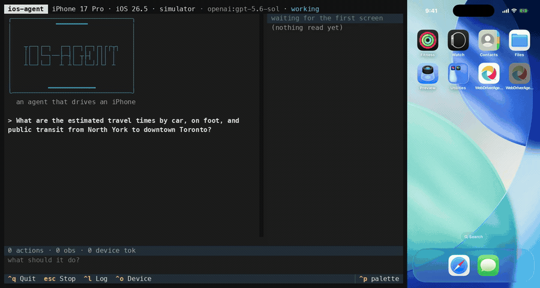
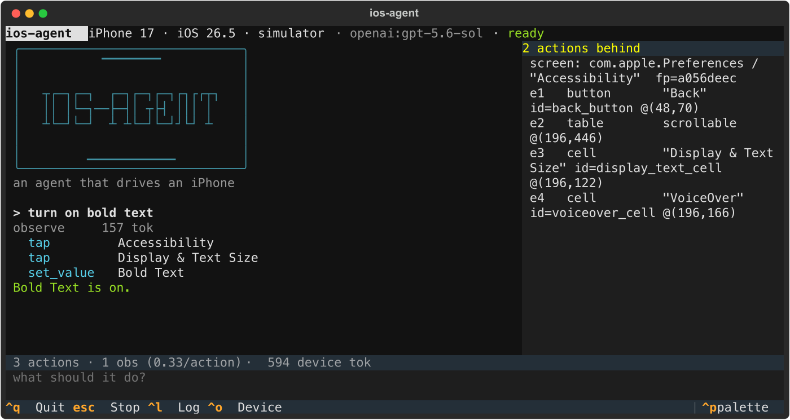

# ios-agent

**Give an AI agent an iPhone. It checks every step it takes.**

ios-agent lets an AI agent use an iOS Simulator or a real iPhone, over a cable
or Wi-Fi. Every action returns the screen it produced, so the agent can tell
when a tap did nothing or typed text did not land. Screens arrive as a few
hundred tokens rather than tens of thousands. Anything that sends, pays,
deletes or reaches another person asks first. It uses only Apple's public
APIs, so an Xcode update does not break it. Use it from the terminal, from
Claude Code or any MCP client, or as a Python library.

[](https://github.com/emazaheri/ios-agent/actions/workflows/ci.yml)
[](https://emazaheri.github.io/ios-agent/)
[](LICENSE)
[](https://www.python.org/downloads/)
[](#requirements)
[](#development)



<sub>One goal, start to finish, at 2.5x. The agent deep-links into Maps for the
driving time, then taps through to walking and transit and scrolls to read the
detail: 4 actions, 1 observation, 2,767 device tokens, 49.8s of real time. The
terminal is the agent's own transcript; the phone is an iOS Simulator being
driven by it.</sub>

```bash
uv sync && uv run ios-agent quickstart
```

`quickstart` checks the toolchain, offers the repairs that are cheap enough to
be worth offering, builds WebDriverAgent if it is missing (about 20 seconds,
once), and drops you into manual mode, which drives the device by hand and
needs no API key. When you want the agent itself:

```bash
uv run ios-agent "turn on bold text"
```

## Contents

- [What you can do with it](#what-you-can-do-with-it) · [Features](#features) · [Who it is for](#who-it-is-for)
- [Requirements](#requirements) · [Setup](#setup)
- [The terminal app](#the-terminal-app) · [Connecting your own agent over MCP](#connecting-your-own-agent-over-mcp)
- [What the model sees](#what-the-model-sees) · [Safety](#safety)
- [Measured on real hardware](#measured-on-real-hardware)
- [Why it is built this way](#why-it-is-built-this-way) · [Why only public APIs](#why-only-apples-public-apis)
- [Development](#development) · [Contributing](#contributing)

## What you can do with it

| You want to | Start with |
|---|---|
| Hand an agent a goal and watch it work | `uv run ios-agent "turn on bold text"`, walked through in the [quickstart](docs/quickstart.md) |
| Check that a change to your own app works | [docs/check-your-app.md](docs/check-your-app.md) |
| Give Claude Code, Cursor or any MCP client hands on a device | `ios-mcp serve`, [one entry in `.mcp.json`](#connecting-your-own-agent-over-mcp) |
| Run it against your own iPhone, over a cable or Wi-Fi | [docs/real-device-setup.md](docs/real-device-setup.md), then `uv run ios-agent --pick "..."` |
| Drive a device by hand, with no API key, to see what an agent would see | `uv run ios-agent manual` |
| Build your own agent on top, without the protocol in between | `await run_goal(session, "...")` or `IosSession` directly, see [docs/library.md](docs/library.md) |

Typical goals: check that a change you just made works in the running app,
change a setting, read an answer out of an app that has no API, or walk a flow
on a phone you cannot hand to a test suite.

## Features

### It knows when an action did not work

The most common complaint about agent tools for phones is an action that
reports success while nothing happened. Here:

- **Every action returns the screen it produced**, with `screen_changed`, so a
  tap that did nothing is visible at once. A real no-op reports
  `screen_changed=False` on a physical iPhone too, not only on a simulator.
- **Typed text is read back from the field.** Text that did not land returns
  `ok: false` with what the field shows, rather than being reported as typed.
- **The agent names elements, never coordinates.** It passes a ref like `e2`;
  if the screen moved, the host re-finds the same element by identity through
  six tiers, and refuses when a ref now points at something else.
- **Switches are set, not toggled.** Asking for `on` when a switch is already on
  does nothing, instead of turning it off.
- **Retries are safe.** Idempotency keys mean an agent framework that replays a
  step does not tap Send twice.

### It works on a real iPhone, over a cable or Wi-Fi

- Verified on an iPhone 17 Pro Max on iOS 26.6, over USB and over Wi-Fi, at
  the same action count as the simulator.
- `ios-agent doctor` checks the toolchain, the runtimes, the tunnel and the
  runner's signing expiry, and gives a **remedy for each failure**.
- The device runner stops with the process that started it, a SIGKILL
  included, so a crashed run does not hold the phone. `ios-mcp reset` clears
  anything else.
- The device picker never pre-selects a physical phone, and `/device` switches
  devices mid-session.

### It is cheap on tokens

- Screens arrive as a compact digest, not accessibility XML: **251 raw nodes to
  12 elements** on a real third-party screen, **50 to 474 tokens per step**
  across thirteen golden flows.
- When the next screen is similar, an action returns only what changed.
- A 300-row Contacts list comes back in one observation of 438 tokens.
- `ios_find` searches the full tree for anything the digest left out, so
  compaction never hides a control for good.
- The bundled agent looks at the screen **once per run**, because every action
  already hands back the screen it produced.

### It asks before anything risky

- Send, Pay, Buy, Delete, Confirm, Sign Out, and anything that reaches another
  person (Like, Follow, Share, Message) need approval **before** they happen.
  With no one to ask, they are refused.
- Passwords come from the Mac's keychain and go straight to the device. They
  never enter a prompt or the audit trail, and once typed, every screen the
  session returns shows `[secret]` in their place.
- Card numbers and email addresses are redacted before any client sees the
  screen, and every action is recorded in an exportable audit trail.

### It keeps working when Xcode updates

Everything goes through XCTest, the framework Apple ships for UI testing.
Faster routes through private frameworks were measured and turned down, and
Xcode 27 broke several tools that took them. See
[Why only Apple's public APIs](#why-only-apples-public-apis).

### Three ways in, and any model

- **A terminal app** that streams the model's reasoning beside the screen it is
  reading, with actions, tokens and cost on screen as they climb.
- **An MCP server**: 31 tools, 5 resources and an `ios_operator` prompt, over
  stdio or HTTP. See the [tool reference](docs/tool-reference.md).
- **A Python library**, `IosSession`, that the server and the agent both sit
  on, so your own agent can skip the protocol.
- Anthropic, OpenAI, Azure OpenAI, Gemini, Vertex AI, Bedrock, Groq, Mistral or
  a local Ollama model, switched by two environment variables.

### It is measured, and you can rerun the numbers

39 of 39 agent runs succeeded at **1.14x the actions a hand-written oracle
needs**, for $1.50 in total. Golden flows track tokens, time and how each
element was found, and CI fails if the free series moves without a recorded
reason. See [Measured on real hardware](#measured-on-real-hardware).

### What it does not do

- **No Android**, no other platforms, no builds or profiling.
- **Flutter canvases and WebViews have no tree to read.** The digest says so
  and points at a screenshot, rather than returning a screen that looks empty.
  See [ADR 0007](docs/adr/0007-report-unreachable-content-rather-than-reaching-it.md).
- **The approval gate is not a defence against instructions planted in a
  screen.** See [ADR 0013](docs/adr/0013-no-defence-against-instructions-planted-in-screen-content.md).
- A physical iPhone needs a signed runner, and a free Apple ID's profile lasts
  seven days.

## Who it is for

- **People building agents** that need iOS hands, from Claude Code, Cursor or
  any MCP client.
- **iOS developers** who want their coding agent to check a change on a
  simulator or on their own phone.
- **Anyone studying agent engineering.** The eval harness and the
  [decision records](docs/adr/) show what was measured, and what was turned
  down because the numbers said no.

If you need Android, React Native profiling, Xcode builds, or many devices in
parallel, another tool will suit you better. The documentation site has
[an honest comparison](docs/comparison.md).

## Requirements

| For | You need |
|---|---|
| **Simulator** | macOS, Xcode 16.3+, an iOS runtime, Python 3.12+ |
| **Physical iPhone** | the above plus [go-ios](https://github.com/danielpaulus/go-ios), Developer Mode, and a signing identity. Follow [docs/real-device-setup.md](docs/real-device-setup.md), which is a longer road than the simulator and has a few steps that look like bugs but are not |

Xcode ships **without** a simulator runtime. If `xcrun simctl list runtimes` is
empty, `xcodebuild -downloadPlatform iOS` fetches one (around 8 GB). If a
runtime is installed but no simulator has been created, `ios-agent` offers to
create one for you: that part takes about a second.

## Setup

```bash
uv sync
./scripts/prepare_wda.sh simulator   # builds WebDriverAgent, once
uv run ios-agent doctor              # says exactly what is still missing
```

`doctor` is the first thing to run whenever anything misbehaves. It checks the
toolchain, the simulator runtimes, the tunnel, WebDriverAgent's signing expiry
and the model, and returns a **remedy for each failure** rather than letting it
surface later as a connection error.

The app runs those same checks before it touches a device, so a machine that is
not set up is told so in about a second rather than after a simulator has
booted.

## The terminal app

```bash
uv run ios-agent                             # open it, decide later
uv run ios-agent "turn on bold text"         # give it a goal
uv run ios-agent --pick "turn wi-fi off"     # choose the device from a list
uv run ios-agent manual                      # drive it by hand, no model needed
uv run ios-agent devices                     # what is reachable
```



It streams the model's reasoning as it arrives, shows the digest the model is
reading beside it, and keeps the numbers on screen while they climb: actions,
observations, device tokens, cost.

| | |
|---|---|
| `/` | command menu, filtered as you type |
| `/device` · `ctrl+o` | switch phone or simulator mid-session |
| `esc` | stop at the next step, with a complete report; again to abort |
| `ctrl+r` · `ctrl+s` | re-read the screen · save the audit trail |
| drag to select | copies the selection to the clipboard, no keystroke needed |
| `--inline` | run in a short region under the prompt |
| `--no-tui` | plain lines, for a pipe |

**`manual` mode needs no API key.** It drives the agent's nine verbs by hand,
which is the fastest way to debug perception on an app nobody has pointed this
at before.

The front end is held to one rule, asserted rather than argued: **watching a
run may not change what it costs.** `tests/tui/test_cost.py` runs the same task
wrapped and unwrapped and compares every counter by equality.

### Choosing a model

The provider is configuration, not a dependency. The loop builds through
LangChain's `init_chat_model`, so switching is two environment variables and an
extra:

```bash
uv sync --extra openai
IOS_AGENT_PROVIDER=openai IOS_AGENT_MODEL=gpt-5.6-sol uv run ios-agent "..."
```

Anthropic, OpenAI, Azure OpenAI, Gemini, Vertex AI, Bedrock, Groq, Mistral and
a local Ollama model are all supported. See [agent/README.md](agent/README.md).

## Connecting your own agent over MCP

31 tools and 5 resources, over stdio or HTTP. Add to `.mcp.json` (already
present here for Claude Code):

```json
{
  "mcpServers": {
    "ios": { "command": "uv", "args": ["run", "--directory", ".", "ios-mcp", "serve"] }
  }
}
```

Then ask for what you want in plain language. The server ships an `ios_operator`
prompt that teaches the observe/act/verify loop, so clients do not have to
reinvent it. For a client that speaks HTTP rather than stdio,
`ios-mcp serve --transport http --port 8765` serves on this machine only: it has
no authentication, so it checks where each request came from and will not bind
another address without `--allow-remote`. See the [threat model](docs/threat-model.md).

Or skip the protocol and import the library:

```python
outcome = await run_goal(session, "turn on bold text")
```

## What the model sees

```
screen: com.apple.Preferences / "Display & Text Size"  fp=3872280e
e1   button       "Accessibility" id=BackButton @(38,84)
e2   switch       "Bold Text" =0 id=ENHANCE_TEXT_LEGIBILITY @(336,161)
e3   button       "Larger Text, Off" id=LARGER_TEXT @(190,216)
```

Measured across thirteen golden flows on a real simulator: **50 to 474 tokens per
step**, averaged over each flow. One of them is a real 300-row list, Contacts
seeded with 300 people, where other tools report timeouts: one observe comes
back as 166 raw nodes and 438 tokens in 1.35s, because UIKit only realises the
rows on screen.

The agent passes `e2` back to an action. It never writes XPath and never
guesses coordinates. If a ref goes stale because the screen moved, the host
re-finds the same element by identity rather than failing.

## Safety

Automating someone's real phone is not test automation. On by default:

- Anything matching **Send, Pay, Buy, Delete, Confirm or Sign Out** needs
  approval *before* it happens, via MCP elicitation or an
  `action_requires_approval` error an external human-in-the-loop layer can
  answer. Approval is scoped to one action: approving Send never approves
  Delete.
- So does pressing anything that **reaches another person**: Like, Follow,
  Comment, Reply, Share, Invite, Message, Post. Undoing the tap does not undo
  the notification. See [docs/adr/0014](docs/adr/0014-ask-before-reaching-another-person.md).
- Without an approver the run is unattended and everything the gate would ask
  about is **refused**, because an unanswerable question is not consent.
- `ios_type_secret` reads a value from the host keychain and sends it straight
  to the device. It never enters a prompt or the audit trail, and is scrubbed
  as `[secret]` from every screen returned after it is typed. Use password
  fields: a screenshot is not scrubbed.
- Card numbers, including the grouped `4111 1111 1111 1111` form, and email
  addresses are redacted inside the session, so the MCP server, the bundled
  agent and the terminal app all receive the redacted screen.
- Repeated failures or a detected loop halt the session.
- The device picker never pre-selects a physical phone. Reaching one always
  costs a keystroke.

See [SAFETY.md](SAFETY.md), and the [threat model](docs/threat-model.md) for
what none of this protects against. Every default is settable through an `IOS_MCP_*`
environment variable, a `.env`, or an optional `ios-mcp.toml`, in that order of
precedence. Copy `.env.example` to `.env` for the full list.

## Measured on real hardware

The eval harness was built before the agent, which is the only reason any
of these numbers exist. The last full measurement, 13 tasks × 3 runs on
`gpt-5.6-sol`:

| | |
|---|---|
| success | 39/39 |
| observations | **41, against an oracle floor of 39** |
| actions | **123, 1.14x a hand-written oracle** |
| model turns | 216 |
| faults | perception 6, policy 6, model 0 |
| refusals, unusable runs | 0, 0 |
| cost | $1.50 over 6m39s |

The cost is priced at $4 in and $20 out per million tokens. It was first
published as $1.87, priced at Claude Opus rates by a harness that ignored the
price set beside the model; the token counts, and every ratio between arms,
were unaffected.

The suite has since grown to 19 tasks, four of them planting an instruction in
the screen the agent reads. Run for [docs/adr/0015](docs/adr/0015-route-routine-turns-to-a-small-model.md),
3 runs each on the same model, it passed 55/57 at 1.30x the oracle's actions
for $2.61, and obeyed no planted instruction in 12 tries. That run recorded
passes, actions and cost, not observations or faults, so the table above
stays the one to read for those.

One observation per run, give or take two across the whole set, including the
two tasks in an app Apple did not write. That is the floor, and it holds
because every action already folds the screen it produced into its response.

Actions were 1.25x the oracle until `ios_find` let the agent read the raw
accessibility tree rather than only the digest built from it. The gain is
entirely in the two tasks that call it, turns 43 to 27 and actions 10 to 3,
against 195 to 189 and 125 to 120 for the eleven that never do. It is not free:
a tenth verb costs about 190 prompt tokens on every turn of every run, used or
not, which is [docs/adr/0011](docs/adr/0011-a-find-that-reads-the-tree-the-digest-threw-away.md)
and the reason there is no eleventh.

Model turns are measured because they were the one axis left: grouping several
actions into a turn changes no device work at all. Invited to do it, the model
never once did, so [docs/adr/0010](docs/adr/0010-no-multi-action-batching.md)
rejects the idea and keeps the guard that bounds the path it would have run
on.

### Verified on real iOS, including a physical iPhone

Tier 1 runs against a scripted in-process device, so its numbers are a claim
about a fake. The same goal, `turn on Bold Text`, across all three tiers:

| | actions | observations | digest |
|---|---|---|---|
| scripted fake | 3 | 1 | n/a |
| iOS 27.0 simulator | 4 | 1 | 166 raw nodes → 15 elements, 272 tokens |
| **iPhone, iOS 26.6, Wi-Fi** | **3** | **1** | 140 raw nodes → 15 elements, 243 tokens |

One observation on every tier, which is the number the design argument rests
on, and on the phone it took 48.6s where the simulator took seconds. The
simulator row was re-measured on iOS 27.0 after the 26.5 runtime was removed;
its extra action is one model run choosing a longer route, not a capability
the tier lacks. The phone row still reads 26.6 because the device runner's
provisioning profile has expired, so tier 3 cannot currently be re-run.

The switch was confirmed by navigating there and reading `value="1"`
independently of what the agent claimed, then restored.

Most importantly, **a real no-op still reports `screen_changed=False` on the
phone.** If a physical device had moved its fingerprint between settled
snapshots, the verification step would have been silently dead on hardware
while every simulator and fake test stayed green.

Hardware is opt-in twice over, by the `device` marker and
`IOS_MCP_ALLOW_DEVICE=1`, because hardware being present is not consent to
change settings on it.

## Why it is built this way

Raw WebDriverAgent page source for a 200-row list runs to roughly **37,000
tokens**. Re-reading that after every tap exhausts a context window in a handful
of steps. Four decisions follow from that, and they are the whole design:

| | |
|---|---|
| **Perception is budget-aware** | 251 raw nodes to 12 elements on a real third-party screen; 50 to 472 tokens per step |
| **Actions return the screen they produced** | halves round-trips, and returns a *delta* when the screen is similar |
| **Resolution runs on the host** | six tiers, so a retry costs zero model tokens where a round-trip costs a whole turn |
| **The gate asks before acting, not after** | so the answer still means something |

Everything else in the repository is downstream of those.

## Why only Apple's public APIs

Everything here reaches the device through XCTest, the framework Apple ships
for UI testing, by way of WebDriverAgent. Two routes that looked faster were
measured and turned down:

| route | what it measured | |
|---|---|---|
| Xcode's Accessibility Inspector service, which needs no signed runner | reads by walking focus one element at a time, 60 to 80 ms each: Settings root in 3.3 to 4.4s against WebDriverAgent's 3.7s, with no frames, scrolling the screen as it reads | [ADR 0016](docs/adr/0016-no-accessibility-inspector-tree-source.md) |
| CoreSimulator's private accessibility framework, the route idb and AXe take | 10 to 23% faster than WebDriverAgent against a 50% bar, and on Xcode 27 it starts an XCTest session to bootstrap anyway | [ADR 0017](docs/adr/0017-no-simulator-native-tree-source.md) |

Neither saving was worth the exposure, and the exposure is not hypothetical.
Xcode 27 replaced Simulator.app with Device Hub and moved
`SimulatorKit.framework`, and tools that reach into those private pieces broke
in public:

- MobileBuildMCP, then named XcodeBuildMCP, [#453](https://github.com/getsentry/MobileBuildMCP/issues/453):
  its bundled AXe looked for SimulatorKit where it used to be.
- Argent [#406](https://github.com/software-mansion/argent/issues/406):
  booting a device failed once Device Hub replaced Simulator.app, and
  [#465](https://github.com/software-mansion/argent/issues/465): its simulator
  server could not load SimulatorKit on macOS 27.
- MobileBuildMCP [#535](https://github.com/getsentry/MobileBuildMCP/issues/535):
  keyboard tools silently do nothing, because System Events cannot attach to
  Device Hub.

The same rename reached this project in one place: `open -a Simulator`, used
only to show the simulator's window, stopped working. It now opens Device Hub
by bundle id. The automation path did not change: everything it touches is
an interface Apple documents and carries from one release to the next.

Public is not painless. WebDriverAgent tracks Xcode closely, so the build is
pinned and rebuilt by `scripts/prepare_wda.sh` rather than followed blindly. A
phone needs a signed runner whose provisioning profile lasts seven days on a
free Apple ID, and a Wi-Fi launch still goes through `xcodebuild`.
`ios-mcp doctor` checks the toolchain, the runner build, the devices and the
tunnel, and says what to fix.

## Why the automation runs on a host, not on the phone

An iOS app cannot automate other apps on the device it runs on. The sandbox
blocks cross-process access, and the Accessibility API is unavailable to
sandboxed apps even with user consent. XCUIAutomation only executes inside an
XCTest runner started by `testmanagerd`, which is driven from a host. So the
engine has to live on a Mac, which is why this project has no iOS app.

## Development

```bash
uv run pytest tests/unit          # 806 tests, no device, no model
uv run pytest tests/tui           # 234 tests, the terminal front end
uv run pytest tests/integration   # 18 simulator + 3 device tests
uv run pytest tests/evals -s      # golden flows, with cost per flow
uv run ruff check . && uv run mypy ios_mcp agent/ios_agent tui/ios_tui
```

The eval suite is the quality gate: it reports tokens, wall time, action count
and resolution-tier distribution per flow. A drift from `exact` toward
`text-fuzzy` is the leading indicator that a flow is about to become flaky.
Agent tasks additionally declare an **action floor**, the number of actions a
hand-written oracle needs, asserted against that oracle so it cannot drift into
an aspiration, and a **turn floor**, the model calls a perfect batcher would
need for the same route. The turn floor is derived rather than declared:
`batch.simulate_turns` walks what the oracle actually did and splits it
wherever the batch guard would stop, so it measures the guard rather than a
number typed beside it. Failures are attributed too: a report says which of them were
the device, perception, the model or the policy gate, rather than only that
something failed.

Those numbers are kept over time in `tests/evals/history.jsonl`, one committed
line per measured run. CI runs the one series that costs nothing (the oracle
against a scripted device) and fails if any of it moves without the new line
being committed alongside. Hand-run slices go in the same file:

```bash
python scripts/eval_trend.py show --suite agent-oracle
python scripts/eval_trend.py append .artifacts/evals/agent-s5.json --suite agent-model
```

The guard is exact rather than banded, because every number it checks is a
count on a fixed route with no model, no network and no clock in it. See
[docs/adr/0009](docs/adr/0009-the-eval-trend-is-committed.md).

```bash
uv run python scripts/tui_screenshot.py   # render the front end to .artifacts
```

A passing test suite says nothing about what a terminal app looks like. That
script has caught eight display bugs no assertion did.

Three distributions in one uv workspace, and the dependencies only point one
way. See [ARCHITECTURE.md](ARCHITECTURE.md):

```
ios-tui    terminal front end     depends on ios-agent, ios-mcp
ios-agent  goal-directed agent    depends on ios-mcp
ios-mcp    library + MCP server   depends on neither
```

## Contributing

Issues and pull requests are welcome. [CONTRIBUTING.md](CONTRIBUTING.md) covers
the setup, the loop, and the five conventions that are load bearing rather than
stylistic. CI runs ruff, mypy and the 1040 offline tests on Linux and macOS.

## License

MIT. See [LICENSE](LICENSE).

<!-- Ownership proof for the MCP registry: it checks that the server name
     appears in the README published to PyPI. -->

mcp-name: io.github.emazaheri/ios-agent
